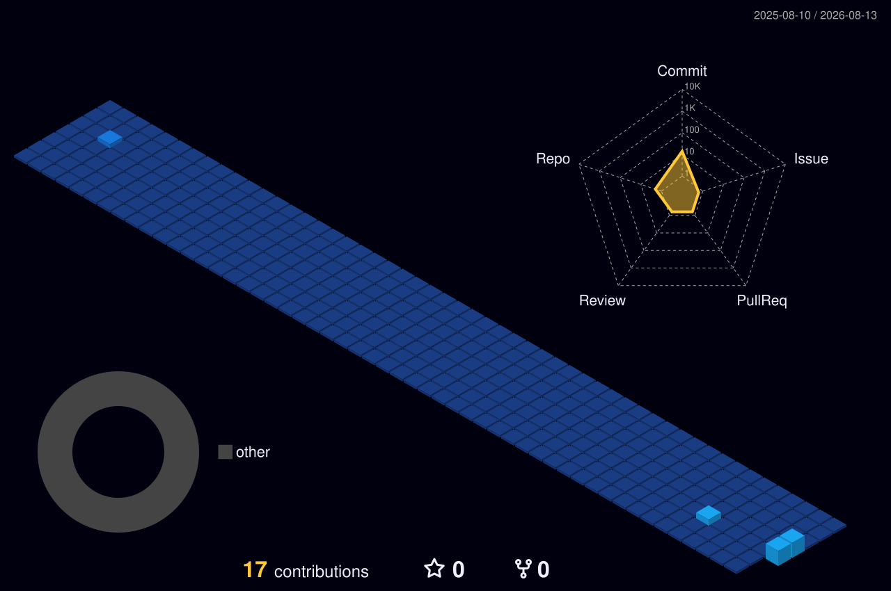

<h1 data-importer="text" align="center">Emiliano Serrano Sánchez</h1>

Engineering solutions line by line, commit by commit 🏙️

###

<!-- Tecnologías y Herramientas -->

  
  
  
  
  
  
  
  
  
  
  
  
  
  
  
  
  

###

<!-- Redes Sociales -->

  
  
  

###

###

<!-- Sección de Estadísticas Actualizada y Funcional -->

  
   <!-- Pequeño espacio entre tarjetas -->
  

###

<!-- Ciudad 3D -->

  

